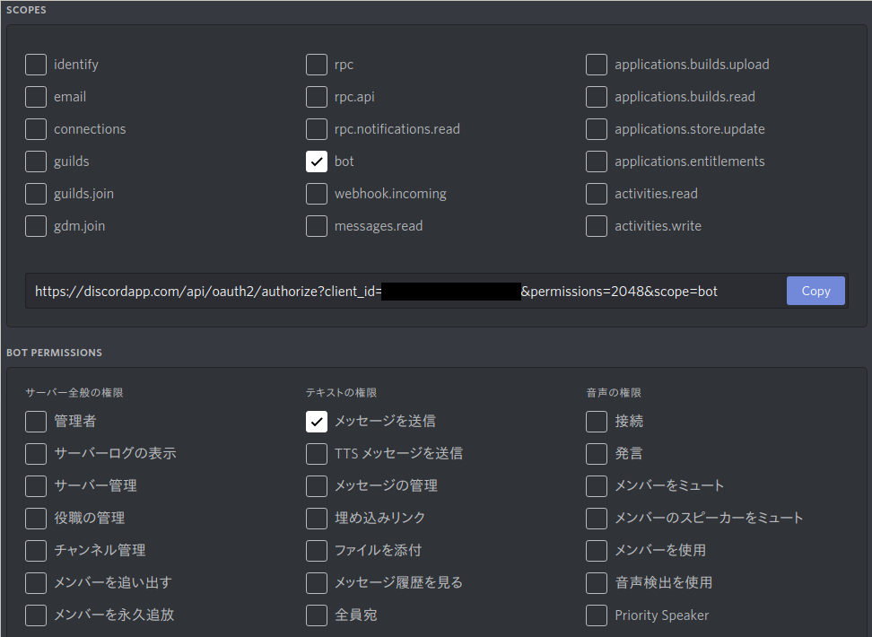

# SO2MarketInfoBotForDiscord

SOLD OUT 2の市場情報を取得してdiscordに流します。

## 概要

ファンタジー世界でお店を経営するゲーム「[SOLD OUT 2](https://so2.mutoys.com/)」の市場情報をDiscordに出力します。

## 使用方法

1. botを動かすためのサーバーを用意します。

1. Discordサーバーを作成します。もしくは管理者権限のあるDiscordサーバーを用意します。

1. [Discordの開発者ページ](https://discordapp.com/developers/applications/)へ行き、アプリを作成します。

1. Botアカウントを作成し、TOKENの下にあるCopyボタンをクリックし、トークンを控えます。

1. OAuth2セクションで以下の項目にチェックを入れてURLをコピーします。
    

1. そのURLを開いて、botを設置するサーバーを選択して認証します。

1. Discordの「ユーザー設定」→「テーマ」へ行き、「開発者モード」のスイッチをオンにします。

1. bot専用のチャンネルを作成します。作成したチャンネル（左部に出ているリスト群から）を右クリックして「IDをコピー」をクリックし、チャンネルIDを控えます。

1. "config.sample.ini"をREADMEに従って編集し、ファイル名を"config.ini"に変更します。

1. Python仮想環境を用意します。

    1. ```venv -p python3 venv```

    1. ```venv/bin/activate``` or ```venv\Scripts\activate```

    1. ```pip install -r requirements.txt```

1. SO2MarketInfo.pyを実行します。あとはDiscordのクライアントで```[コマンド] [商品名]```と入力するとできます。

## config.iniについて

config.iniは設定ファイルです。適切に編集されていないとプログラムが正常に動作しない場合がありますのでご注意ください。

### [discord]

主にDiscordまわりの設定をします。

#### token

botアカウントのトークンを記載します。

#### channel

botを反応させるチャンネルを指定します。複数指定はできません。  
チャンネルは開発者モードで得ることができるチャンネルIDで指定してください。

### [command]

コマンドを編集できます。  
市場情報を受け取るデフォルトコマンドは```!market```ですが、設定を変更して例えば```/bazzar```にすることもできます。

#### prefix

コマンドの最初の文字を指定できます。  
デフォルトでは!(エクスクラメーションマーク)が指定されています。

#### market

市場情報を受け取るコマンドの文字列を指定できます。  
デフォルトではmarketが指定されています。

## Alias.pyについて

Alias.pyでは商品の略称・通称を指定することができます。編集はPythonの文法に従って行うようにしてください。  
```elif```で```itemName```に通称を代入したあと、```return```で正式名称を返す仕組みになっています。通称はorを使うことによって複数指定が可能です。

## 注意点

- このプログラムの改造はMITライセンスに則る限り自由ですが、API周りを改造する場合、[API仕様ページ](https://so2-docs.mutoys.com/common/api.html)に記載されている利用条件は必ず守るようにしてください。

- APIの仕様上、ファイルを保管してから処理する方式になっています。

- APIの仕様上取得上限を定めることができないため、１ファイルの容量がかなり大きくなっています(確認できた限りでは最大で2.5MB)。直接テキストエディタで開かないことをおすすめします。

- このアプリの機能は予告なく変更される可能性があります。

## LICENSE

MIT License. See [LICENSE](LICENSE) file.
